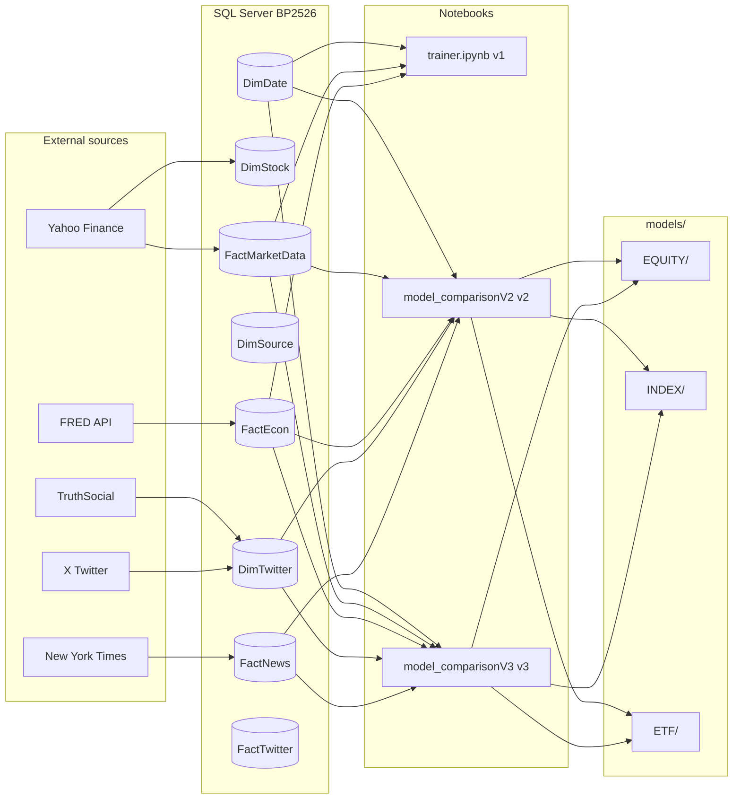

# BachelorProef 2026 — Beursvoorspellingen met neuraal netwerk

> Multifactoriële pipeline die koersdata, economische indicatoren en sentiment uit X (Twitter), TruthSocial en nieuws combineert om de richting van beurskoersen te voorspellen voor 181 financiële instrumenten.
>
> *Multifactor pipeline combining price data, economic indicators and sentiment from X (Twitter), TruthSocial and news to predict stock market direction for 181 financial instruments.*

[Nederlands](#nederlands) · [English](#english)

---

## Nederlands

### Overzicht

Dit project is de codebasis van de bachelorproef *"Een neuraal netwerkmodel voor beursvoorspellingen"* (HoGent, 2025 2026). Het bouwt een geautomatiseerde data pipeline op een SQL Server datawarehouse, en evalueert tien machine learning modellen op drie iteraties:

- **v1** — `SpikeDipLSTM` prototype in PyTorch op tien aandelen.
- **v2** — vergelijkende benchmark over tien modellen op de binaire richtingstaak.
- **v3** — schaalvergroting naar 181 instrumenten, sentiment per stock via een sentence transformer, plus een `isPresident` kenmerk (2$\times$ boost) voor tweets van Trump.

### Belangrijkste cijfers

- **181 financiële instrumenten** (EQUITY, ETF, INDEX) uit `DimStock`.
- **470 856 stock-dag rijen** in de uiteindelijke trainingsset (v3).
- **Test accuratesse tot 93%** op individuele stocks (iShares 7 tot 10 Year Treasury Bond ETF), met outliers ook op Unilever PLC (0,81) en de Invesco DB US Dollar Index Bullish Fund (0,80).
- **Beste model per stocktype** wordt automatisch opgeslagen: LightGBM voor EQUITY en ETF, GRU voor INDEX.

### Databronnen

| Bron | Inhoud | Methode |
|---|---|---|
| Yahoo Finance | OHLCV koersdata van 181 stocks | `yfinance` library |
| FRED | Macro reeksen (VIX, USD, CPI, FedFundsRate, …) | FRED REST API |
| New York Times | Nieuwsartikelen (titel + abstract) | NYT API |
| X (Twitter) | Trump tweets, 1 januari 2016 tot 14 februari 2022 | Eigen scraper |
| TruthSocial | Trump posts vanaf 15 februari 2022 | Eigen scraper |

De bron switch voor Trump berichten wordt op datumniveau afgehandeld zodat de tijdsreeks continu blijft.

### Projectstructuur

```
BachelorProef2026/
├── README.md                          ← dit bestand
├── requirements.txt
├── .env                               ← API sleutels (niet in git)
├── database/
│   ├── DDL.sql                        ← schema (sterschema, 4 fact + 3 dim)
│   ├── starschema_bp.drawio
│   └── connectie/connectie.py         ← get_engine() + loadIN()
├── data/
│   ├── data_fetching/
│   │   ├── yahoo/fetcher.py           ← 181 tickers OHLCV
│   │   ├── Econ/fetcher.py            ← FRED macro
│   │   ├── dimdate/fetcher.py
│   │   ├── dimTime/fetcher.py
│   │   ├── truthSocial/merged.py      ← Trump posts scraping
│   │   ├── x_twitter/load.py          ← X CSV loader
│   │   └── news/fetcher.py            ← NYT + NewsAPI
│   ├── processed/                     ← CSV voor offline gebruik
│   └── raw/                           ← ruwe responses
├── model/
│   ├── trainer.ipynb                  ← v1 SpikeDipLSTM prototype
│   └── comparison/
│       ├── model_comparisonV2.ipynb   ← v2: tien modellen, binair
│       ├── model_comparisonV3.ipynb   ← v3: 181 stocks, sentiment per stock
│       ├── save_best_models.py        ← gedeeld helper script
│       └── artifacts_v2/ v3/          ← plots, CSV, modelranking
└── models/                            ← bewaarde beste modellen per type
    ├── EQUITY/  (best.json + LightGBM.joblib)
    ├── INDEX/   (best.json + GRU.pt)
    └── ETF/     (best.json + LightGBM.joblib)
```

### Architectuur


### Setup

1. **Virtuele omgeving en dependencies**

   ```powershell
   python -m venv venv
   .\venv\Scripts\activate
   pip install -r requirements.txt
   ```

2. **`.env` in de projectroot** met de API sleutels:

   ```
   DB_SERVER=127.0.0.1,1500
   DB_NAME=BP2526
   DB_DRIVER=ODBC Driver 17 for SQL Server
   databaseUser=sa
   databasePWD=YOUR_PASSWORD

   API_KEY_FRED=...
   NYT_API_KEY=...
   NEWS_API_KEY=...

   my_twitter_email=...
   my_twitter_username=...
   my_twitter_password=...

   TRUTHSOCIAL_USERNAME=...
   TRUTHSOCIAL_PASSWORD=...
   TRUTHSOCIAL_TOKEN=...

   groq_API=...   # optioneel
   ```

3. **SQL Server database**

   ```powershell
   sqlcmd -S localhost,1500 -U sa -P <password> -i database\DDL.sql
   ```

   Of voer `database/DDL.sql` uit in SSMS.

### Pipeline runnen

Volgorde van fetchers (FK relaties dwingen deze volgorde af):

```python
from database.connectie.connectie import get_engine, loadIN
from data.data_fetching.dimdate.fetcher import CreateDimDate
from data.data_fetching.dimTime.fetcher  import dimTime
from data.data_fetching.Econ.fetcher     import econFetcher
from data.data_fetching.yahoo.fetcher    import fetch_stocks_to_long_format
from data.data_fetching.news.fetcher     import factNews, dimSource
from data.data_fetching.truthSocial.merged import get_twitter_tables, build_fact_twitter
from data.data_fetching.x_twitter.load    import load_x_tweets

engine = get_engine()

# 1. Dimensies eerst
loadIN(engine, CreateDimDate(), 'DimDate')
loadIN(engine, dimTime(),       'DimTime')
loadIN(engine, dimSource(),     'DimSource')

# 2. Yahoo: DimStock + FactMarketData
ds, fm = fetch_stocks_to_long_format()
loadIN(engine, ds, 'DimStock')
loadIN(engine, fm, 'FactMarketData')

# 3. Macro
loadIN(engine, econFetcher(), 'FactEcon')

# 4. TruthSocial
dim_df, fact_raw = get_twitter_tables(engine, daily=False)
if not dim_df.empty:
    loadIN(engine, dim_df, 'DimTwitter')
    loadIN(engine, build_fact_twitter(engine, fact_raw), 'FactTwitter')

# 5. X (Twitter) CSV append
load_x_tweets(engine)

# 6. Nieuws
loadIN(engine, factNews(engine=engine, daily=False), 'FactNews')
```

Dagelijkse incrementele updates: zet `daily=True` op de fetchers die het ondersteunen.

### Modelversies vergelijken

| Versie | Notebook | Hoofdpunten |
|---|---|---|
| v1 | `model/trainer.ipynb` | `SpikeDipLSTM`, drie klasse op tien stocks, 35% test accuratesse. |
| v2 | `model/comparison/model_comparisonV2.ipynb` | Tien modellen binair: Majority, LogReg, RF, XGBoost, LightGBM, MLP, 1D CNN, GRU, LSTM, CNN+LSTM. |
| v3 | `model/comparison/model_comparisonV3.ipynb` | 181 stocks, impact scoring per stock via sentence transformer, `isPresident` kenmerk, binair én drie klasse. |

Open in Jupyter of VS Code, dan **Kernel → Restart → Run All**. Tip: doe vóór commit altijd **Cell → All Output → Clear**, anders kan het notebook bestand corrupt raken bij grote DataFrame outputs op Windows mounts.

### Belangrijkste resultaten

- Geen enkel model overtreft de Majority baseline (0,540) op globale binaire accuratesse, maar de neurale modellen leveren Brier scores rond 0,25 tegenover 0,46 voor Majority. Dat zijn aanzienlijk beter gekalibreerde kansvoorspellingen.
- **Beste model per stocktype**: LightGBM voor EQUITY (0,525) en ETF (0,537); GRU voor INDEX (0,539).
- **Outliers boven 80%** op de model versus stock heatmap: iShares 7 tot 10 Year Treasury Bond ETF (0,93), Unilever PLC (0,81), Invesco DB US Dollar Index Bullish Fund (0,80).
- Sentimentanalyse voegt marginaal toe voor langetermijn ETF portefeuilles maar wel meetbare winst voor hoog risico traders op volatiele individuele aandelen.

### Bekende valkuilen

1. **Notebook corruption op Windows mount.** Doe **Cell → All Output → Clear** voor je commit. Tijdens het schrijven van grote DataFrame outputs kan het `.ipynb` bestand truncate.
2. **`torch._subclasses` AttributeError.** Versie mismatch tussen `torch`, `transformers` en `sentence-transformers`. Fix: `pip install --no-cache-dir "torch>=2.3,<2.6"`.
3. **DDL drift.** Historische versies van het schema hadden `FactMarketData.StockKey` als `INT` (nu `VARCHAR(10)`). Volg altijd het meegeleverde `database/DDL.sql` script.
4. **sklearn 1.5+.** `LogisticRegression(multi_class="multinomial")` werkt niet meer; auto detectie volstaat.
5. **pandas 2.2+ `groupby.apply()`.** Strippt de groupby kolom. Notebooks gebruiken een manuele loop:
   ```python
   out = []
   for sid, g in df.groupby("stock_id", sort=False):
       g2 = func(g); g2["stock_id"] = sid; out.append(g2)
   df = pd.concat(out, ignore_index=True)
   ```

### Licentie en credits

Bachelorproef HoGent, academiejaar 2025 2026. Voor academisch gebruik.
Externe bibliotheken: zie `requirements.txt`. Data: Yahoo Finance, FRED, NYT, NewsAPI, X (Twitter), TruthSocial.

Promotor: Giselle Vercauteren · Co-promotor: Steven Anthonis.

---

## English

### Overview

This repository contains the code base for the bachelor thesis *"A neural network model for stock market predictions"* (HoGent, 2025 2026). It builds an automated data pipeline on top of a SQL Server data warehouse and evaluates ten machine learning models across three iterations:

- **v1** — `SpikeDipLSTM` prototype in PyTorch on ten stocks.
- **v2** — comparative benchmark across ten models on the binary direction task.
- **v3** — scaled up to 181 instruments, sentiment per stock via a sentence transformer, plus an `isPresident` feature (2$\times$ boost) for Trump tweets.

### Key numbers

- **181 financial instruments** (EQUITY, ETF, INDEX) in `DimStock`.
- **470,856 stock day rows** in the final training set (v3).
- **Test accuracy up to 93%** on individual stocks (iShares 7 to 10 Year Treasury Bond ETF), with outliers on Unilever PLC (0.81) and the Invesco DB US Dollar Index Bullish Fund (0.80).
- **Best model per stock type** is saved automatically: LightGBM for EQUITY and ETF, GRU for INDEX.

### Data sources

| Source | Content | Method |
|---|---|---|
| Yahoo Finance | OHLCV price data for 181 stocks | `yfinance` library |
| FRED | Macro series (VIX, USD, CPI, FedFundsRate, …) | FRED REST API |
| New York Times | News articles (title + abstract) | NYT API |
| X (Twitter) | Trump tweets, January 1, 2016 to February 14, 2022 | Custom scraper |
| TruthSocial | Trump posts from February 15, 2022 onwards | Custom scraper |

The source switch for Trump's posts is handled at the date level so the time series remains continuous.

### Project structure

```
BachelorProef2026/
├── README.md
├── requirements.txt
├── .env                               ← API keys (not in git)
├── database/
│   ├── DDL.sql                        ← schema (star, 4 fact + 3 dim)
│   ├── starschema_bp.drawio
│   └── connectie/connectie.py         ← get_engine() + loadIN()
├── data/
│   ├── data_fetching/
│   │   ├── yahoo/fetcher.py           ← 181 tickers OHLCV
│   │   ├── Econ/fetcher.py            ← FRED macro
│   │   ├── dimdate/fetcher.py
│   │   ├── dimTime/fetcher.py
│   │   ├── truthSocial/merged.py      ← Trump posts scraping
│   │   ├── x_twitter/load.py          ← X CSV loader
│   │   └── news/fetcher.py            ← NYT + NewsAPI
│   ├── processed/                     ← CSVs for offline use
│   └── raw/                           ← raw API responses
├── model/
│   ├── trainer.ipynb                  ← v1 SpikeDipLSTM prototype
│   └── comparison/
│       ├── model_comparisonV2.ipynb   ← v2: ten models, binary
│       ├── model_comparisonV3.ipynb   ← v3: 181 stocks, per-stock sentiment
│       ├── save_best_models.py        ← shared helper
│       └── artifacts_v2/ v3/          ← plots, CSVs, rankings
└── models/                            ← best saved model per type
    ├── EQUITY/  (best.json + LightGBM.joblib)
    ├── INDEX/   (best.json + GRU.pt)
    └── ETF/     (best.json + LightGBM.joblib)
```

### Architecture



### Setup

1. **Virtual environment and dependencies**

   ```powershell
   python -m venv venv
   .\venv\Scripts\activate
   pip install -r requirements.txt
   ```

2. **`.env` in the project root** with the API keys:

   ```
   DB_SERVER=127.0.0.1,1500
   DB_NAME=BP2526
   DB_DRIVER=ODBC Driver 17 for SQL Server
   databaseUser=sa
   databasePWD=YOUR_PASSWORD

   API_KEY_FRED=...
   NYT_API_KEY=...
   NEWS_API_KEY=...

   my_twitter_email=...
   my_twitter_username=...
   my_twitter_password=...

   TRUTHSOCIAL_USERNAME=...
   TRUTHSOCIAL_PASSWORD=...
   TRUTHSOCIAL_TOKEN=...

   groq_API=...   # optional
   ```

3. **SQL Server database**

   ```powershell
   sqlcmd -S localhost,1500 -U sa -P <password> -i database\DDL.sql
   ```

   Or run `database/DDL.sql` from SSMS.

### Running the pipeline

Fetcher order is enforced by foreign keys:

```python
from database.connectie.connectie import get_engine, loadIN
from data.data_fetching.dimdate.fetcher import CreateDimDate
from data.data_fetching.dimTime.fetcher  import dimTime
from data.data_fetching.Econ.fetcher     import econFetcher
from data.data_fetching.yahoo.fetcher    import fetch_stocks_to_long_format
from data.data_fetching.news.fetcher     import factNews, dimSource
from data.data_fetching.truthSocial.merged import get_twitter_tables, build_fact_twitter
from data.data_fetching.x_twitter.load    import load_x_tweets

engine = get_engine()

# 1. Dimensions first
loadIN(engine, CreateDimDate(), 'DimDate')
loadIN(engine, dimTime(),       'DimTime')
loadIN(engine, dimSource(),     'DimSource')

# 2. Yahoo: DimStock + FactMarketData
ds, fm = fetch_stocks_to_long_format()
loadIN(engine, ds, 'DimStock')
loadIN(engine, fm, 'FactMarketData')

# 3. Macro econ
loadIN(engine, econFetcher(), 'FactEcon')

# 4. TruthSocial
dim_df, fact_raw = get_twitter_tables(engine, daily=False)
if not dim_df.empty:
    loadIN(engine, dim_df, 'DimTwitter')
    loadIN(engine, build_fact_twitter(engine, fact_raw), 'FactTwitter')

# 5. X (Twitter) CSV append
load_x_tweets(engine)

# 6. News
loadIN(engine, factNews(engine=engine, daily=False), 'FactNews')
```

For daily incremental updates, set `daily=True` on the fetchers that support it.

### Comparing model versions

| Version | Notebook | Highlights |
|---|---|---|
| v1 | `model/trainer.ipynb` | `SpikeDipLSTM`, three class on ten stocks, 35% test accuracy. |
| v2 | `model/comparison/model_comparisonV2.ipynb` | Ten models, binary: Majority, LogReg, RF, XGBoost, LightGBM, MLP, 1D CNN, GRU, LSTM, CNN+LSTM. |
| v3 | `model/comparison/model_comparisonV3.ipynb` | 181 stocks, per-stock impact scoring via sentence transformer, `isPresident` feature, binary plus three class. |

Open in Jupyter or VS Code, then **Kernel → Restart → Run All**. Tip: always run **Cell → All Output → Clear** before you commit, otherwise the notebook file may corrupt when large DataFrame outputs are written on Windows mounts.

### Key results

- No model beats the Majority baseline (0.540) on global binary accuracy, but the neural models achieve Brier scores around 0.25 versus 0.46 for Majority. Those are substantially better calibrated probability predictions.
- **Best model per stock type**: LightGBM for EQUITY (0.525) and ETF (0.537); GRU for INDEX (0.539).
- **Outliers above 80%** on the model versus stock heatmap: iShares 7 to 10 Year Treasury Bond ETF (0.93), Unilever PLC (0.81), Invesco DB US Dollar Index Bullish Fund (0.80).
- Sentiment analysis adds little for long term ETF portfolios but provides measurable gains for high risk traders on volatile individual stocks.

### Known pitfalls

1. **Notebook corruption on Windows mounts.** Run **Cell → All Output → Clear** before committing. Large DataFrame outputs can truncate the `.ipynb` file during write.
2. **`torch._subclasses` AttributeError.** Version mismatch between `torch`, `transformers` and `sentence-transformers`. Fix: `pip install --no-cache-dir "torch>=2.3,<2.6"`.
3. **DDL drift.** Older schema versions had `FactMarketData.StockKey` as `INT` (now `VARCHAR(10)`). Always use the bundled `database/DDL.sql`.
4. **sklearn 1.5+.** `LogisticRegression(multi_class="multinomial")` is gone; automatic detection suffices.
5. **pandas 2.2+ `groupby.apply()`.** Strips the groupby column. Notebooks use a manual loop:
   ```python
   out = []
   for sid, g in df.groupby("stock_id", sort=False):
       g2 = func(g); g2["stock_id"] = sid; out.append(g2)
   df = pd.concat(out, ignore_index=True)
   ```

### License and credits

HoGent bachelor thesis, academic year 2025 2026. For academic use.
External libraries: see `requirements.txt`. Data: Yahoo Finance, FRED, NYT, NewsAPI, X (Twitter), TruthSocial.

Promotor: Giselle Vercauteren · Co-promotor: Steven Anthonis.
