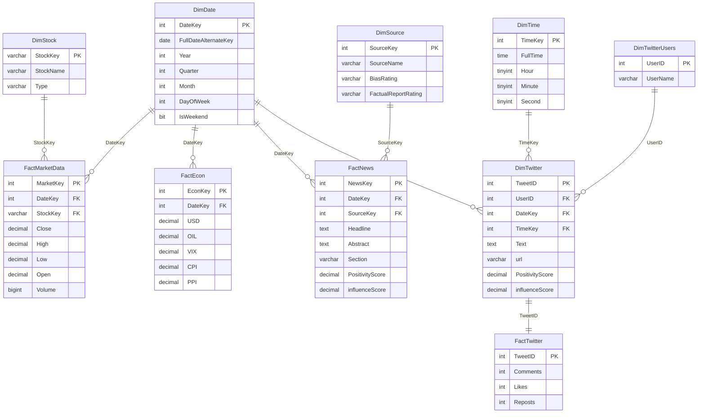

# Database — BP2526

SQL Server database met een **star schema** voor stock direction prediction.
Bevat dimensie- en fact-tabellen voor markt-, macro-, sentiment- en
nieuwsdata.

---

## Star Schema



**Origineel**: [`starschema_bp.drawio`](starschema_bp.drawio) — open met
[draw.io desktop](https://www.drawio.com/).

---

## Tabel-overzicht

### Dimensies

| Tabel              | Grain                | Hoofdkolommen |
|--------------------|----------------------|---------------|
| `DimDate`          | 1 rij per dag        | DateKey (PK, INT in `YYYYMMDD` formaat), FullDateAlternateKey, kalenderattributen |
| `DimTime`          | 1 rij per (HH:MM:SS) | TimeKey (PK), Hour, Minute, Second, AMPM |
| `DimStock`         | 1 rij per ticker     | StockKey (PK VARCHAR(10) bv. `AAPL`, `^GSPC`), StockName, Type (EQUITY/INDEX/ETF) |
| `DimTwitterUsers`  | 1 rij per gebruiker  | UserID (PK IDENTITY), UserName |
| `DimTwitter`       | 1 rij per tweet      | TweetID (PK IDENTITY), Text, url, sentiment scores |
| `DimSource`        | 1 rij per nieuwsbron | SourceKey (PK IDENTITY), SourceName, BiasRating |

### Facts

| Tabel             | Grain                       | Hoofdkolommen |
|-------------------|-----------------------------|---------------|
| `FactMarketData`  | 1 rij per (Date, Stock)     | OHLCV |
| `FactEcon`        | 1 rij per Date              | 11 macro-indicators |
| `FactTwitter`     | 1 rij per Tweet             | Comments, Likes, Reposts |
| `FactNews`        | 1 rij per nieuws-item       | Headline, Abstract, Section, sentiment |

---

## Connection setup

`database/connectie/connectie.py` levert drie helpers:

```python
from database.connectie.connectie import get_engine, loadIN, getData

engine = get_engine()                                # SQLAlchemy engine
df = getData(engine, "SELECT * FROM DimStock")       # query → DataFrame
loadIN(engine, df, "FactMarketData",                 # DataFrame → INSERT
       if_exists="append")
```

Configuratie via `.env` in project root:

```env
DB_SERVER=127.0.0.1,1500           # of localhost\SQLEXPRESS
DB_NAME=BP2526
DB_DRIVER=ODBC Driver 17 for SQL Server
databaseUser=sa
databasePWD=YOUR_PASSWORD
```

De engine gebruikt `pyodbc` met `Encrypt=yes; TrustServerCertificate=yes`
zodat het op een lokale dev-machine zonder valid cert werkt.

### Database aanmaken vanaf nul

```powershell
sqlcmd -S localhost,1500 -U sa -P <password> -i database\DDL.sql
```

Of plak `DDL.sql` in **SSMS** en run.

---

## Volledige DDL

Zie [`DDL.sql`](DDL.sql) — bevat de complete `CREATE TABLE` statements
inclusief PKs, FKs en datatypes.

Belangrijkste kolom-types (samengevat):

```sql
-- DimDate.DateKey = INT in formaat YYYYMMDD (bv. 20240315)
-- DimTime.TimeKey = INT in formaat HHMMSS  (bv. 154428)
-- DimStock.StockKey = VARCHAR(10) (bv. 'AAPL', '^GSPC', 'BRK-B')
-- FactMarketData heeft één PK: MarketKey (IDENTITY)
-- FactNews.NewsKey ontbreekt soms in deployed schema (DDL drift)
```

---

## Bekende quirks

### 1. `DimDate` start vanaf 2016

`data/data_fetching/dimdate/fetcher.py` heeft `start_date='2016-01-01'`
hardcoded. Wil je oudere tweets/data ondersteunen (bv. Trump tweets vanaf
2009), wijzig dit en run een delete-and-rebuild van DimDate.

### 2. `FactMarketData` PRIMARY KEY conflict

In een vroegere versie van de DDL stond:
```sql
MarketKey INT IDENTITY(1,1) PRIMARY KEY,
StockKey  VARCHAR(10) PRIMARY KEY,   -- ← INVALID: 2 PKs
```
SQL Server staat maar één PK per tabel toe. Nu opgelost — alleen
`MarketKey` is PK.

### 3. `FactNews.NewsKey` ontbreekt in deployed schema

Sommige deployed DBs missen de `NewsKey` kolom. Onze loaders selecteren
hem niet (we hebben hem ook niet nodig voor downstream queries).

### 4. `if_exists="replace"` vernietigt constraints

Pandas `to_sql(... if_exists="replace")` drop't de tabel en herbouwt
hem zonder de FK constraints uit `DDL.sql`. Voor schone refresh: gebruik
DELETE + APPEND (zie root README).

```python
from sqlalchemy import text
with engine.begin() as conn:
    conn.execute(text("DELETE FROM FactMarketData"))   # eerst child
    conn.execute(text("DELETE FROM DimStock"))         # dan parent
loadIN(engine, dimstock,       'DimStock',       if_exists='append')
loadIN(engine, factMarketData, 'FactMarketData', if_exists='append')
```

### 5. StockKey trimming

Sommige rijen hebben trailing whitespace in `StockKey`. Queries die op
StockKey joinen moeten `LTRIM(RTRIM(StockKey))` aan beide zijden gebruiken
om mismatches te voorkomen. De model-comparison notebooks doen dit in hun
SQL.

---

## Sanity checks via SSMS

```sql
-- Hoeveel rijen per fact tabel?
SELECT 'FactMarketData' AS tbl, COUNT(*) AS n FROM FactMarketData
UNION ALL SELECT 'FactEcon',     COUNT(*) FROM FactEcon
UNION ALL SELECT 'FactNews',     COUNT(*) FROM FactNews
UNION ALL SELECT 'FactTwitter',  COUNT(*) FROM FactTwitter
UNION ALL SELECT 'DimTwitter',   COUNT(*) FROM DimTwitter
UNION ALL SELECT 'DimStock',     COUNT(*) FROM DimStock;

-- Date range
SELECT MIN(DateKey), MAX(DateKey), COUNT(*) FROM DimDate;

-- Stocks per type
SELECT [Type], COUNT(*) FROM DimStock GROUP BY [Type];

-- Tweet bulk per maand
SELECT FORMAT(DATEFROMPARTS(DateKey/10000, (DateKey/100)%100, 1), 'yyyy-MM') AS month,
       COUNT(*) AS tweets
FROM DimTwitter
GROUP BY DateKey/100
ORDER BY 1;
```
