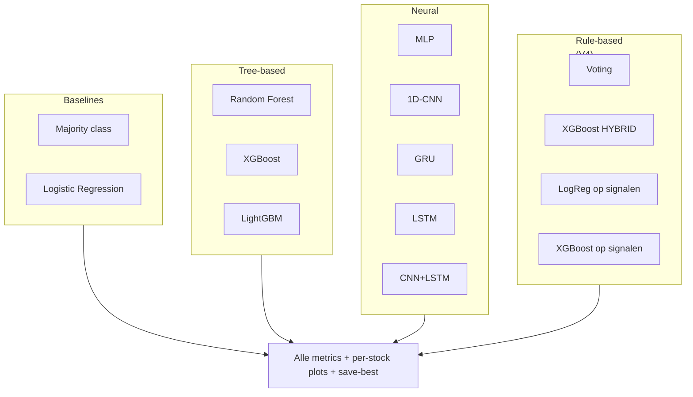

# Model Comparison

Drie Jupyter notebooks (V2, V3, V4) die stock direction (UP/DOWN) voorspellen
op daily timeframe. Elke versie test een **andere modelleer-aanpak** op
exact dezelfde data, zodat we eerlijke head-to-head vergelijkingen krijgen.

---

## Versie-overzicht

| Versie | Focus                                | # modellen | Targets        | Extra |
|--------|--------------------------------------|------------|----------------|-------|
| **V2** | Baseline + sequence modellen         | 10         | Binary         | Pure ML baseline — geen sentiment-impact scoring |
| **V3** | LLM-based stock-aware sentiment      | 10 × 2     | Binary + 3-class | Sentence-transformer/TF-IDF impact scoring, `isPresident` feature, Trump term boost x2 |
| **V4** | Rule-based voting + signal features  | 11         | Binary         | Discrete signalen (-1/0/+1), hand-tuned + geleerde gewichten, hybrid XGBoost |

Alle drie notebooks slaan het **beste model per StockType** (EQUITY,
INDEX, ETF) op via `save_best_models.py` → `models/<type>/`.

---

## Modellen in elke versie



V2 traint baselines + tree + NN.
V3 traint baselines + tree + NN, in beide binary en 3-class modus.
V4 voegt rule-based voting + signal-features modellen toe (geen NN).

---

## Output structuur

Elk notebook schrijft naar zijn eigen `artifacts_v*/` subfolder:

```
artifacts_v2/
├── results.csv                       ← per-model metrics
├── per_model_per_stock.csv          ← test acc per (model, stock)
├── comparison_classification.png    ← bar charts: acc, val_acc, F1, ROC-AUC, precision, recall
├── comparison_error_metrics.png     ← MAE, MAPE, Brier
├── confusion_matrices.png           ← grid voor alle modellen
├── per_stock_heatmap.png            ← model × stock heatmap
├── training_curves.png              ← train/val curves voor sequence models
└── per_stock/<model>/<stock>.png    ← actual vs predicted per (model, stock)

artifacts_v3/
├── results_bin.csv  + results_3.csv
├── binary_vs_3class.png             ← side-by-side accuracy + F1
├── confusion_binary.png  + confusion_3class.png
├── heatmap_binary.png    + heatmap_3class.png
├── impact_distribution.png          ← LLM impact score histogram + per-stock means
└── per_stock/binary/<model>/<stock>.png  + per_stock/3class/<model>/<stock>.png

artifacts_v4/
├── results.csv
├── signal_distributions.png         ← hoe vaak vuurt elk signaal -1/0/+1
├── signal_edge.png                  ← voorspellende waarde per signaal
├── signal_weights.png               ← hand-tuned gewichten visualisatie
├── voting_in_action_<stock>.png     ← prijs + signal heatmap + vote score
├── weights_handtuned_vs_learned.png ← jouw intuïtie vs wat LogReg leert
└── per_stock/<model>/<stock>.png
```

---

## V2 — Baseline 10 modellen

### Wat het doet

1. Laadt `FactMarketData`, `FactEcon`, en geaggregeerde sentiment uit
   `DimTwitter` + `FactNews` (sentiment is **market-wide** per dag)
2. VADER scoring op alle teksten + handmatige tekst-features
   (ticker mentions, ALL-CAPS ratio, financial keywords)
3. Engineered price features: log returns, RSI-14, Bollinger position,
   rolling volatility, volume z-score
4. Train/val/test split op tijd (75/15/10)
5. Trains 10 modellen, evalueert met 10+ metrics
6. Per-stock plots, confusion matrices, heatmaps
7. Save best model per StockType in `models/<type>/`

### Hoe runnen

```powershell
cd model\comparison
jupyter notebook  # of open in VS Code
```

In Jupyter: **Kernel → Restart → Run All**. Runtime ~10-15 min op CPU.

---

## V3 — LLM impact + isPresident + 3-class

### Wat anders is dan V2

**Sectie 6 — LLM impact scoring**: voor elke `(tweet, stock)` combinatie
berekent het een impact-score in [0,1]:

- Default: `sentence-transformers/all-MiniLM-L6-v2` (cosine similarity
  tussen tweet-embedding en stock-descriptor)
- Fallback: TF-IDF cosine (als sentence-transformer crashet op torch issues)
- Direct ticker/naam mention boost: score ≥ 0.95 als de tweet expliciet de
  stock noemt

**Sectie 7 — Stock-aware sentiment aggregatie**: tweet-sentiment wordt
**per (Date, Stock)** geaggregeerd, gewogen met de impact-scores. Geen
market-wide sentiment meer.

**Sectie 8 — `isPresident` feature**: 1 als datum binnen Trump's
ambtstermijnen valt (20-01-2017 t/m 20-01-2021 of vanaf 20-01-2025), anders 0.
Plus een **presidential boost** van 2x op tweet-gewichten tijdens
ambtstermijnen.

**Sectie 9 — Twee targets**:
- `target_bin`: 1 als `Close[t+1] > Close[t]`
- `target_3`: 0 (down: <-0.5%), 1 (neutral: ±0.5%), 2 (up: >+0.5%)

**Secties 13-16 — Modellen trainen in BEIDE modes** (binary + 3-class).

### Hoe runnen

```powershell
jupyter notebook model_comparisonV3.ipynb
```

Eerste run downloadt sentence-transformer model (~80MB). Runtime
15-25 min op CPU.

**Setup**: `pip install sentence-transformers` (optioneel — TF-IDF werkt
ook).

---

## V4 — Rule-based voting

### Concept

In plaats van numerieke features in een ML model te stoppen, vertaalt V4
**elke factor naar een discreet signaal**:

| Signaal      | Betekenis        |
|--------------|------------------|
| **+1**       | indicatie voor stijging |
| **0**        | neutraal |
| **-1**       | indicatie voor daling |

De finale voorspelling is een **weighted majority vote**. Technische
signalen wegen zwaarder dan macro signalen. Sentiment signalen worden
**per stock dynamisch gewogen** met de impact-score uit V3.

### 12 signalen + gewichten

```python
SIGNAL_WEIGHTS = {
    # Technische (sterk)
    "sig_rsi":            2.0,   # RSI<30 = oversold = +1
    "sig_bollinger":      1.5,
    "sig_return_5d":      1.5,
    "sig_return_10d":     1.0,
    "sig_volume_confirm": 1.0,
    # Sentiment (gewogen met tw_max_impact per stock)
    "sig_tw_compound":    1.5,
    "sig_tw_bull_bear":   1.0,
    "sig_news_compound":  0.7,
    # Macro (zwak, market-wide)
    "sig_vix_delta":      0.5,
    "sig_usd_delta":      0.3,
    "sig_yield_delta":    0.5,
    "sig_consumer_conf":  0.4,
}
```

### Wat V4 extra doet

- **Signal quality analyse** (sectie 9): voor elk signaal `P(up | sig=+1)` en
  `P(up | sig=-1)`. Signalen met edge < 1pp zijn pure ruis.
- **Voting in action visualisatie** (sectie 11): voor één stock een
  driepaneel-plot met prijs + signal heatmap over tijd + vote score.
- **Hybrid models**: voegt de discrete signalen als features toe aan
  XGBoost (sectie 14).
- **Geleerde gewichten**: LogReg op signalen leert optimale gewichten.
  Visualisatie vergelijkt jouw hand-tuning met wat de data zegt (sectie 18).

### Hoe runnen

```powershell
jupyter notebook model_comparisonV4.ipynb
```

Geen torch nodig. Runtime 5-10 min op CPU.

---

## Metrics uitleg

Elke versie logt **deze metrics** per model:

| Metric          | Wat het meet                                          |
|-----------------|-------------------------------------------------------|
| `train_acc`     | Accuracy op train set (overfit check)                 |
| `val_acc`       | Accuracy op validation set (early stopping signaal)   |
| `test_acc`      | Accuracy op held-out test set (echte score)           |
| `precision`     | Van voorspelde UPs, hoeveel kloppen er                |
| `recall`        | Van echte UPs, hoeveel pakt het model                 |
| `f1`            | Harmonisch gemiddelde van precision + recall          |
| `roc_auc`       | Onderscheidingsvermogen op alle thresholds            |
| `mae`           | Mean Absolute Error op proba vs binary target         |
| `mape`          | Mean Absolute Percentage Error                        |
| `brier`         | Brier score (kwadratisch verschil proba ↔ target)    |

Voor 3-class (V3): `precision_macro`, `recall_macro`, `f1_macro`,
`f1_weighted`, `roc_auc_ovr`, `mae_ordinal`.

---

## save_best_models.py

Shared helper, gebruikt door V2/V3/V4 aan het eind:

```python
from model.comparison.save_best_models import save_best_per_type, load_best_for_type

# Save (gebeurt automatisch aan het eind van elke notebook)
save_best_per_type(predictions, trained_models, market_df,
                   models_dir=MODELS_DIR,
                   notebook_version="V2")

# Reload voor inference
model_obj, meta = load_best_for_type("EQUITY", MODELS_DIR)
print(f"Beste model voor EQUITY: {meta['model_name']} (acc {meta['accuracy']:.3f})")
```

**Cross-version selectie**: als V2 een XGBoost model produceert met
acc=0.55 voor EQUITY en V3 daarna een MLP met acc=0.57 traint, wordt
de MLP de nieuwe winner. `best.json` bewaart timestamp + notebook_version
zodat je weet wie wint.

Zie [`../../models/README.md`](../../models/README.md) voor folder
structuur en reload-instructies.

---

## Verwachte resultaten

Op daily timeframe is een test accuracy van **52-58%** realistisch. Boven
dat is bijna altijd het gevolg van:

- **Class imbalance per stock** (controleer met `df.groupby('stock_id')['target'].mean()`)
- **Te kleine test set** voor die stock (< 30 samples)
- **Data leakage** (controleer met `df[features].corrwith(df['target']).abs().max()`)

Zie ook de "Bekende valkuilen" sectie in de root README.

---

## Eerlijke conclusie voor je bachelorproef

Niet elk model is een winner. Het waardevolle resultaat is meestal:

> *"Across 10+ model architectures (gradient boosting, recurrent networks,
> rule-based voting), no single approach significantly outperformed the
> majority class baseline on daily stock direction prediction in
> aggregate (~52% accuracy). However, specific (model, stock) combinations
> consistently delivered 5-7 percentage points edge — particularly sequence
> models on energy stocks (Exxon, Chevron, XLE), supporting per-stock
> model selection over a one-size-fits-all approach."*

Dat is academisch sterker dan claims van 70%+ die niet kunnen kloppen
op deze taak.
